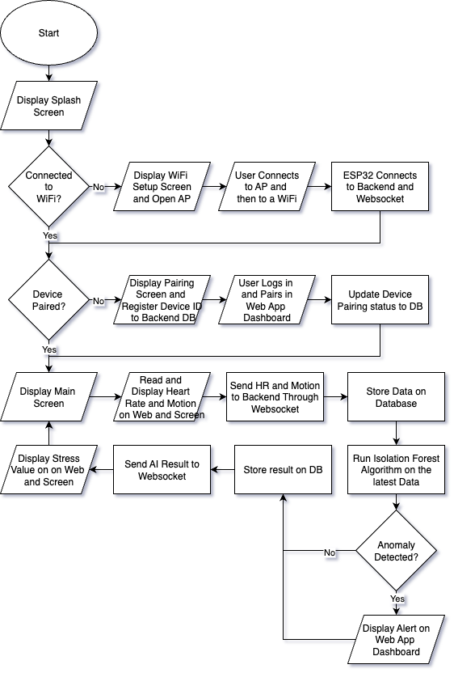
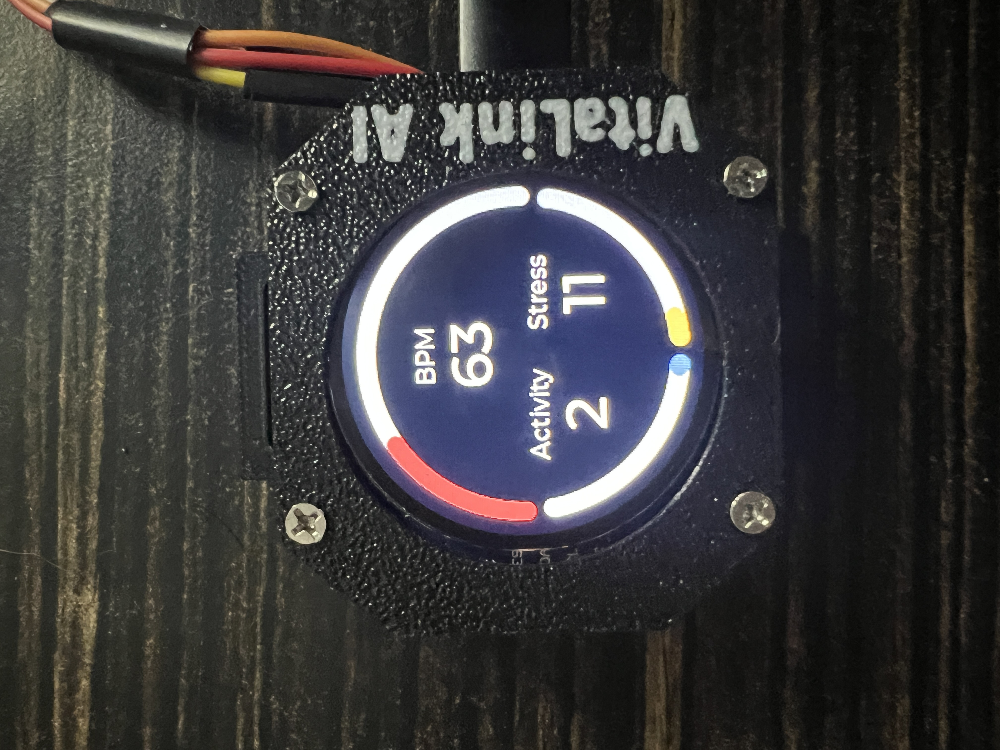
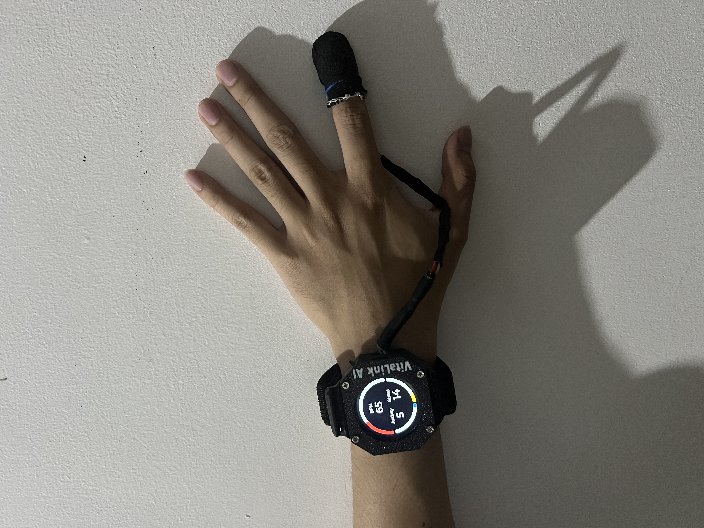
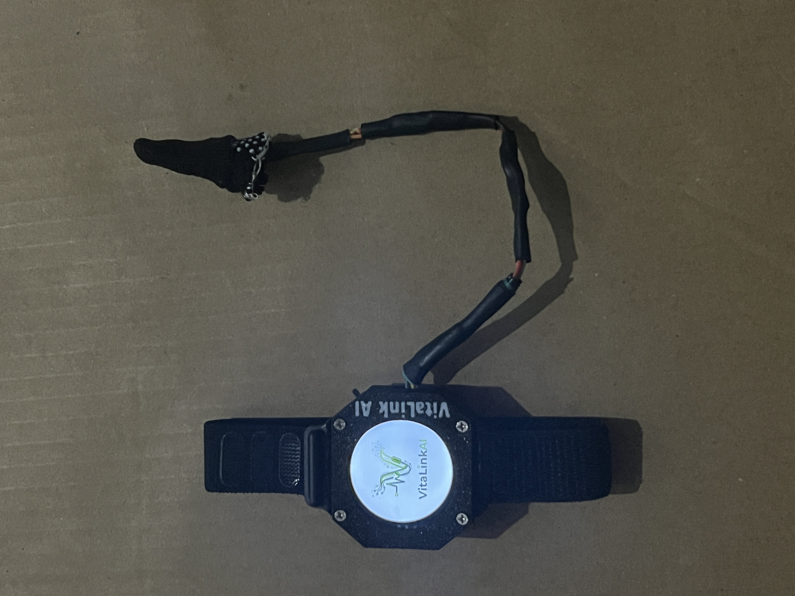
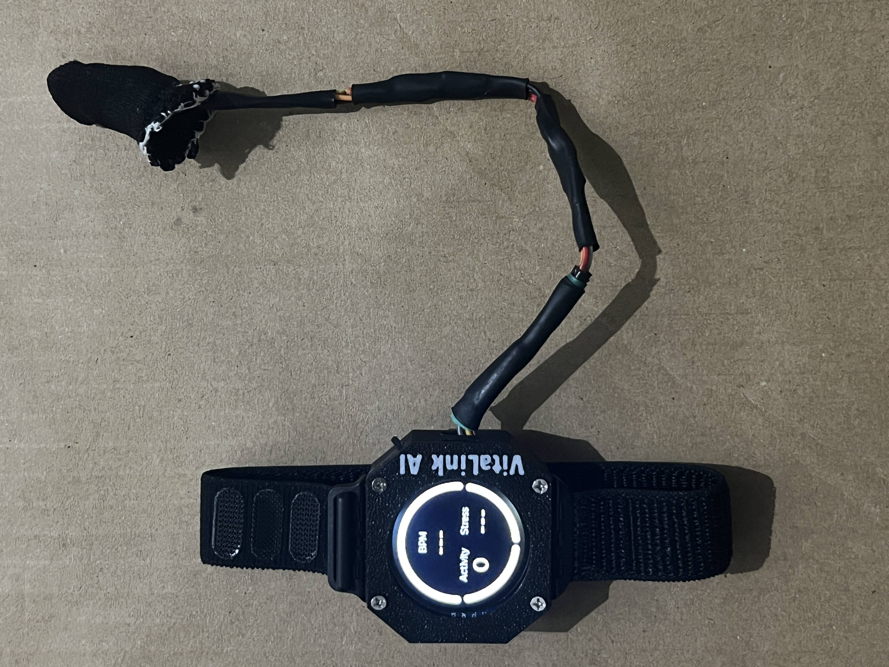

# 📊 IoT Health & Activity Dashboard for Students

An IoT-powered web-based system that monitors **students’ vital signs and stress indicators in real time**.  
The system integrates sensors, microcontrollers, AI anomaly detection, and a dashboard interface to help students and school staff track wellness and prevent fatigue or stress-related risks.

---

## 🚀 Project Overview
- Uses **MAX30102** heart rate sensor and **MPU6050** motion sensor connected to an **ESP32**.
- Data is transmitted to a backend server for **storage, analysis, and visualization**.
- An **Isolation Forest AI model** detects abnormal patterns related to stress or irregular activity.
- The **web-based dashboard** displays live and historical data, highlighting potential health alerts.

---

## 🎯 Purpose
To provide **real-time health and activity monitoring** for students, enabling early identification of stress, fatigue, or abnormal activity patterns for better wellness management.

---

## 📌 Objectives
- Capture real-time **heart rate** and **motion/activity** data.
- Transmit and store sensor data via ESP32 to the backend.
- Apply **Isolation Forest AI** for anomaly detection.
- Display live and historical data in an interactive **dashboard**.
- Provide **alerts** for abnormal readings.

---

## ⚙️ Features & Functions
- ❤️ **Heart Rate Sensor (MAX30102):** Tracks heart rate to assess stress and activity.
- 🏃 **Motion Sensor (MPU6050):** Detects steps, movements, and inactivity.
- 📡 **ESP32 Microcontroller:** Collects and transmits sensor data.
- 🖥️ **Backend (Flask/FastAPI):** Processes and stores data, runs AI model.
- 🗄️ **Database (MySQL/SQLite):** Stores real-time & historical data.
- 🤖 **AI Module (Isolation Forest):** Detects anomalies in health/activity patterns.
- 📊 **Web Dashboard:** Interactive charts for live & historical data.
- 🔔 **Health Alerts:** Notifications for abnormal readings.

---

## 🛠️ Tools & Technologies
- **Hardware:** ESP32, MAX30102, MPU6050  
- **Software:** Python (Flask/FastAPI), React.js, MySQL/SQLite  
- **AI/ML:** Isolation Forest (Scikit-learn)  
- **Other Tools:** GitHub, Postman, Chart.js/Recharts  

---

## 🗂️ Flowchart

Here’s the overall system flow of the project:

  

---

## 🔌 Device

Photos of the physical hardware setup:

  
  
  
  

---

## 👨‍💻 Contributors
- *Exconde, Mark Jeric B.* 
- *Flores, Zyra Mae G.*  
- *Guran, John Raymon D.*  
- *Macalintal, Jasmine Q.*  
- *Canlas, Jhun Mark E.*  

---

## 📜 License
This project is licensed under the **MIT License** – feel free to use, modify, and improve.